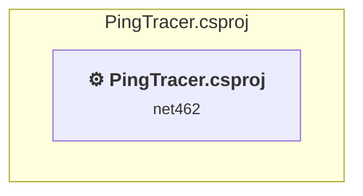

# Projects and dependencies analysis

This document provides a comprehensive overview of the projects and their dependencies in the context of upgrading to .NETCoreApp,Version=v10.0.

## Table of Contents

- [Executive Summary](#executive-Summary)
  - [Highlevel Metrics](#highlevel-metrics)
  - [Projects Compatibility](#projects-compatibility)
  - [Package Compatibility](#package-compatibility)
  - [API Compatibility](#api-compatibility)
- [Aggregate NuGet packages details](#aggregate-nuget-packages-details)
- [Top API Migration Challenges](#top-api-migration-challenges)
  - [Technologies and Features](#technologies-and-features)
  - [Most Frequent API Issues](#most-frequent-api-issues)
- [Projects Relationship Graph](#projects-relationship-graph)
- [Project Details](#project-details)

  - [PingTest\PingTracer.csproj](#pingtestpingtracercsproj)

## Executive Summary

### Highlevel Metrics

| Metric | Count | Status |
| :--- | :---: | :--- |
| Total Projects | 1 | All require upgrade |
| Total NuGet Packages | 0 | All compatible |
| Total Code Files | 43 |  |
| Total Code Files with Incidents | 22 |  |
| Total Lines of Code | 7457 |  |
| Total Number of Issues | 4104 |  |
| Estimated LOC to modify | 4102+ | at least 55.0% of codebase |

### Projects Compatibility

| Project | Target Framework | Difficulty | Package Issues | API Issues | Est. LOC Impact | Description |
| :--- | :---: | :---: | :---: | :---: | :---: | :--- |
| [PingTest\PingTracer.csproj](#pingtestpingtracercsproj) | net462 | 🟡 Medium | 0 | 4102 | 4102+ | ClassicWinForms, Sdk Style = False |

### Package Compatibility

| Status | Count | Percentage |
| :--- | :---: | :---: |
| ✅ Compatible | 0 | 0.0% |
| ⚠️ Incompatible | 0 | 0.0% |
| 🔄 Upgrade Recommended | 0 | 0.0% |
| ***Total NuGet Packages*** | ***0*** | ***100%*** |

### API Compatibility

| Category | Count | Impact |
| :--- | :---: | :--- |
| 🔴 Binary Incompatible | 3945 | High - Require code changes |
| 🟡 Source Incompatible | 155 | Medium - Needs re-compilation and potential conflicting API error fixing |
| 🔵 Behavioral change | 2 | Low - Behavioral changes that may require testing at runtime |
| ✅ Compatible | 5967 |  |
| ***Total APIs Analyzed*** | ***10069*** |  |

## Aggregate NuGet packages details

| Package | Current Version | Suggested Version | Projects | Description |
| :--- | :---: | :---: | :--- | :--- |

## Top API Migration Challenges

### Technologies and Features

| Technology | Issues | Percentage | Migration Path |
| :--- | :---: | :---: | :--- |
| Windows Forms | 3945 | 96.2% | Windows Forms APIs for building Windows desktop applications with traditional Forms-based UI that are available in .NET on Windows. Enable Windows Desktop support: Option 1 (Recommended): Target net9.0-windows; Option 2: Add <UseWindowsDesktop>true</UseWindowsDesktop>; Option 3 (Legacy): Use Microsoft.NET.Sdk.WindowsDesktop SDK. |
| GDI+ / System.Drawing | 149 | 3.6% | System.Drawing APIs for 2D graphics, imaging, and printing that are available via NuGet package System.Drawing.Common. Note: Not recommended for server scenarios due to Windows dependencies; consider cross-platform alternatives like SkiaSharp or ImageSharp for new code. |
| Windows Forms Legacy Controls | 130 | 3.2% | Legacy Windows Forms controls that have been removed from .NET Core/5+ including StatusBar, DataGrid, ContextMenu, MainMenu, MenuItem, and ToolBar. These controls were replaced by more modern alternatives. Use ToolStrip, MenuStrip, ContextMenuStrip, and DataGridView instead. |
| Legacy Configuration System | 2 | 0.0% | Legacy XML-based configuration system (app.config/web.config) that has been replaced by a more flexible configuration model in .NET Core. The old system was rigid and XML-based. Migrate to Microsoft.Extensions.Configuration with JSON/environment variables; use System.Configuration.ConfigurationManager NuGet package as interim bridge if needed. |

### Most Frequent API Issues

| API | Count | Percentage | Category |
| :--- | :---: | :---: | :--- |
| T:System.Windows.Forms.CheckBox | 316 | 7.7% | Binary Incompatible |
| T:System.Windows.Forms.Label | 298 | 7.3% | Binary Incompatible |
| T:System.Windows.Forms.AnchorStyles | 219 | 5.3% | Binary Incompatible |
| T:System.Windows.Forms.NumericUpDown | 193 | 4.7% | Binary Incompatible |
| T:System.Windows.Forms.TextBox | 127 | 3.1% | Binary Incompatible |
| T:System.Windows.Forms.Button | 111 | 2.7% | Binary Incompatible |
| T:System.Windows.Forms.Control.ControlCollection | 91 | 2.2% | Binary Incompatible |
| P:System.Windows.Forms.Control.Controls | 91 | 2.2% | Binary Incompatible |
| P:System.Windows.Forms.Control.Name | 90 | 2.2% | Binary Incompatible |
| T:System.Windows.Forms.GroupBox | 87 | 2.1% | Binary Incompatible |
| M:System.Windows.Forms.Control.ControlCollection.Add(System.Windows.Forms.Control) | 87 | 2.1% | Binary Incompatible |
| P:System.Windows.Forms.Control.Size | 84 | 2.0% | Binary Incompatible |
| P:System.Windows.Forms.Control.TabIndex | 83 | 2.0% | Binary Incompatible |
| P:System.Windows.Forms.Control.Location | 83 | 2.0% | Binary Incompatible |
| T:System.Windows.Forms.Panel | 81 | 2.0% | Binary Incompatible |
| T:System.Windows.Forms.MenuItem | 77 | 1.9% | Binary Incompatible |
| P:System.Windows.Forms.CheckBox.Checked | 68 | 1.7% | Binary Incompatible |
| T:System.Windows.Forms.ToolTip | 50 | 1.2% | Binary Incompatible |
| P:System.Windows.Forms.NumericUpDown.Value | 39 | 1.0% | Binary Incompatible |
| T:System.Windows.Forms.CheckState | 39 | 1.0% | Binary Incompatible |
| T:System.Windows.Forms.ComboBox | 38 | 0.9% | Binary Incompatible |
| P:System.Windows.Forms.Label.Text | 36 | 0.9% | Binary Incompatible |
| P:System.Windows.Forms.Control.Anchor | 35 | 0.9% | Binary Incompatible |
| P:System.Windows.Forms.Control.Width | 32 | 0.8% | Binary Incompatible |
| T:System.Windows.Forms.TreeView | 31 | 0.8% | Binary Incompatible |
| T:System.Windows.Forms.DialogResult | 31 | 0.8% | Binary Incompatible |
| M:System.Windows.Forms.ToolTip.SetToolTip(System.Windows.Forms.Control,System.String) | 29 | 0.7% | Binary Incompatible |
| P:System.Windows.Forms.ButtonBase.Text | 27 | 0.7% | Binary Incompatible |
| M:System.Windows.Forms.Label.#ctor | 27 | 0.7% | Binary Incompatible |
| P:System.Windows.Forms.Control.Enabled | 25 | 0.6% | Binary Incompatible |
| P:System.Windows.Forms.ButtonBase.UseVisualStyleBackColor | 25 | 0.6% | Binary Incompatible |
| F:System.Windows.Forms.AnchorStyles.Bottom | 25 | 0.6% | Binary Incompatible |
| F:System.Windows.Forms.AnchorStyles.Left | 25 | 0.6% | Binary Incompatible |
| F:System.Windows.Forms.AnchorStyles.Right | 24 | 0.6% | Binary Incompatible |
| T:System.Windows.Forms.SplitContainer | 23 | 0.6% | Binary Incompatible |
| T:System.Drawing.Brush | 23 | 0.6% | Source Incompatible |
| T:System.Windows.Forms.Keys | 22 | 0.5% | Binary Incompatible |
| T:System.Windows.Forms.Form | 22 | 0.5% | Binary Incompatible |
| P:System.Windows.Forms.Label.AutoSize | 22 | 0.5% | Binary Incompatible |
| P:System.Windows.Forms.TextBox.Text | 21 | 0.5% | Binary Incompatible |
| T:System.Windows.Forms.AutoScaleMode | 21 | 0.5% | Binary Incompatible |
| T:System.Windows.Forms.TrackBar | 19 | 0.5% | Binary Incompatible |
| E:System.Windows.Forms.CheckBox.CheckedChanged | 18 | 0.4% | Binary Incompatible |
| F:System.Windows.Forms.AnchorStyles.Top | 18 | 0.4% | Binary Incompatible |
| T:System.Drawing.Font | 18 | 0.4% | Source Incompatible |
| T:System.Windows.Forms.DockStyle | 18 | 0.4% | Binary Incompatible |
| M:System.Windows.Forms.CheckBox.#ctor | 18 | 0.4% | Binary Incompatible |
| T:System.Drawing.Graphics | 18 | 0.4% | Source Incompatible |
| P:System.Windows.Forms.PaintEventArgs.Graphics | 18 | 0.4% | Binary Incompatible |
| T:System.Windows.Forms.MessageBox | 17 | 0.4% | Binary Incompatible |

## Projects Relationship Graph

Legend:
📦 SDK-style project
⚙️ Classic project

## Project Details

### PingTest\PingTracer.csproj

#### Project Info

- **Current Target Framework:** net462
- **Proposed Target Framework:** net10.0-windows
- **SDK-style**: False
- **Project Kind:** ClassicWinForms
- **Dependencies**: 0
- **Dependants**: 0
- **Number of Files**: 52
- **Number of Files with Incidents**: 22
- **Lines of Code**: 7457
- **Estimated LOC to modify**: 4102+ (at least 55.0% of the project)

#### Dependency Graph

Legend:
📦 SDK-style project
⚙️ Classic project

### API Compatibility

| Category | Count | Impact |
| :--- | :---: | :--- |
| 🔴 Binary Incompatible | 3945 | High - Require code changes |
| 🟡 Source Incompatible | 155 | Medium - Needs re-compilation and potential conflicting API error fixing |
| 🔵 Behavioral change | 2 | Low - Behavioral changes that may require testing at runtime |
| ✅ Compatible | 5967 |  |
| ***Total APIs Analyzed*** | ***10069*** |  |

#### Project Technologies and Features

| Technology | Issues | Percentage | Migration Path |
| :--- | :---: | :---: | :--- |
| Legacy Configuration System | 2 | 0.0% | Legacy XML-based configuration system (app.config/web.config) that has been replaced by a more flexible configuration model in .NET Core. The old system was rigid and XML-based. Migrate to Microsoft.Extensions.Configuration with JSON/environment variables; use System.Configuration.ConfigurationManager NuGet package as interim bridge if needed. |
| Windows Forms Legacy Controls | 130 | 3.2% | Legacy Windows Forms controls that have been removed from .NET Core/5+ including StatusBar, DataGrid, ContextMenu, MainMenu, MenuItem, and ToolBar. These controls were replaced by more modern alternatives. Use ToolStrip, MenuStrip, ContextMenuStrip, and DataGridView instead. |
| GDI+ / System.Drawing | 149 | 3.6% | System.Drawing APIs for 2D graphics, imaging, and printing that are available via NuGet package System.Drawing.Common. Note: Not recommended for server scenarios due to Windows dependencies; consider cross-platform alternatives like SkiaSharp or ImageSharp for new code. |
| Windows Forms | 3945 | 96.2% | Windows Forms APIs for building Windows desktop applications with traditional Forms-based UI that are available in .NET on Windows. Enable Windows Desktop support: Option 1 (Recommended): Target net9.0-windows; Option 2: Add <UseWindowsDesktop>true</UseWindowsDesktop>; Option 3 (Legacy): Use Microsoft.NET.Sdk.WindowsDesktop SDK. |

